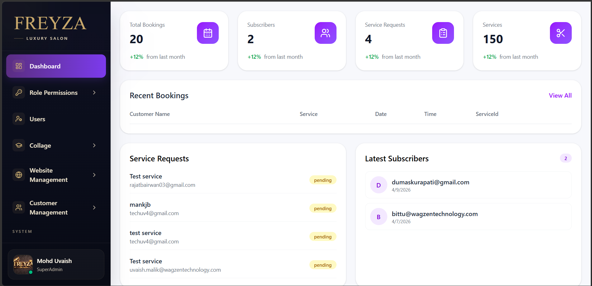
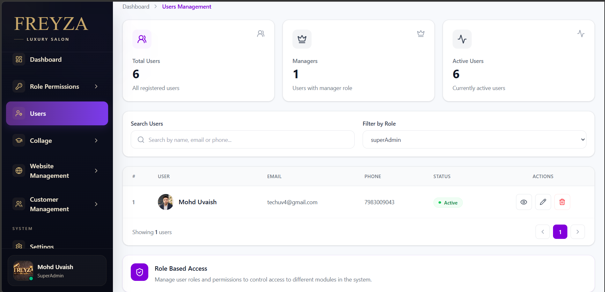
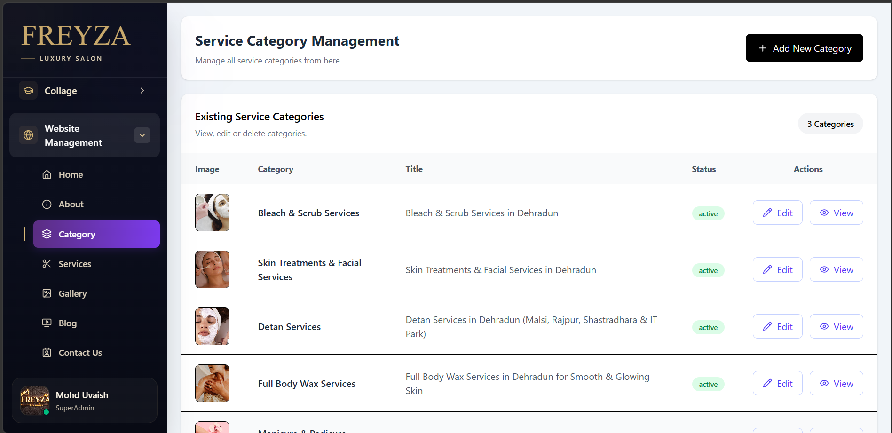
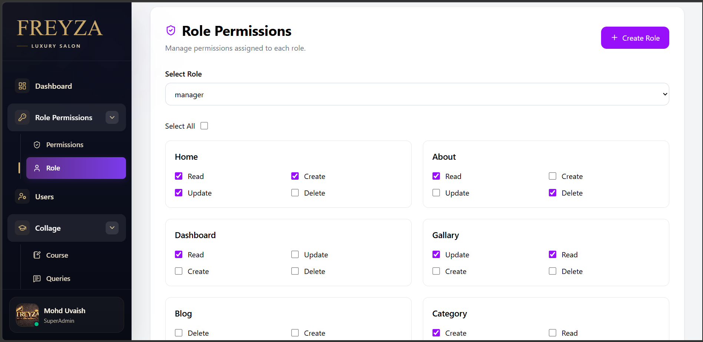

# Freyza Admin Panel

A full-stack admin panel for managing salon and academy operations, including users, courses, services, customer requests, bookings, and role-based permissions.

## Dashboard Preview



## Screenshots

### Users Management



### Course Management


### Service Category Management



### Role-Based Permissions



## Features

- Admin dashboard with booking and service statistics
- User management
- User details and profile management
- Role-based access control (RBAC)
- Role and permission management
- Course management
- Service category management
- Website content management
- Customer management
- Customer query management
- CRUD operations
- Email notification workflows
- Responsive admin interface

## Tech Stack

### Frontend
- React
- TypeScript
- Vite
- CSS
- REST API integration

### Backend
- NestJS
- TypeScript
- REST APIs
- Database integration
- Email service integration

### Development Tools
- Git
- GitHub
- npm
- Environment variables

## Project Structure

```text
Freyza_admin_pannel/
├── admin_frontend/
│   ├── src/
│   ├── public/
│   └── package.json
│
├── admin_backend/
│   ├── src/
│   └── package.json
│
├── screenshots/
│   ├── dashboard.png
│   ├── users-management.png
│   ├── courses.png
│   ├── service-category.png
│   └── role-permissions.png
│
└── README.md
```

## Installation

### 1. Clone the Repository

```bash
git clone https://github.com/techuv4-dotcom/freyza_admin.git
cd freyza_admin
```

### 2. Backend Setup

```bash
cd admin_backend
npm install
```

Create a `.env` file with the required database and email configuration.

Start the backend:

```bash
npm run start:dev
```

### 3. Frontend Setup

Open a new terminal:

```bash
cd admin_frontend
npm install
npm run dev
```

The frontend will normally run on:

```text
http://localhost:5173
```

## Application Flow

```text
Admin / Customer
       ↓
   Frontend
       ↓
   REST APIs
       ↓
    Backend
       ↓
    Database
       ↓
Admin Dashboard / Email Notifications
```

## Role-Based Access Control

The admin panel includes role-based permissions that allow administrators to control access to different modules and operations.

Permissions can be managed for operations such as:

- Read
- Create
- Update
- Delete

## Environment Variables

Sensitive credentials should never be committed to GitHub.

Example:

```env
PORT=5000
DATABASE_URL=your_database_url
RECEPTIONIST_EMAIL=your_receptionist_email
MAIL_FROM_ADDRESS=your_email
```

Keep `.env` files in `.gitignore`.

## Production Build

### Frontend

```bash
cd admin_frontend
npm run build
```

### Backend

```bash
cd admin_backend
npm run build
```

## Git Workflow

After making changes:

```bash
git add .
git commit -m "Describe your changes"
git push
```

## Author

**Mohd Uvaish**

Full Stack Developer
